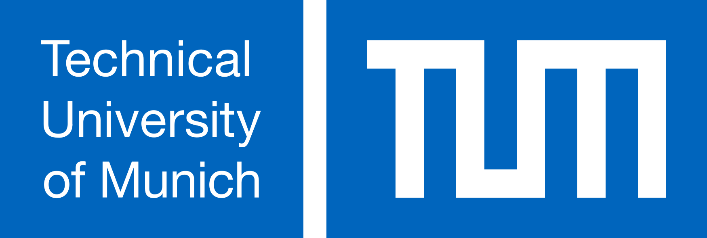

  
# Bachelor’s Thesis in Information Systems
  
## AI-Driven Workflow for Inconsistency Remediation in Programming Exercises

### School of Computation, Information and Technology
  
### -- Informatics --
Author: Mikhail Khinevich

Supervisor: Prof. Dr. Stephan Krusche

## Abstract

Automated quality assurance for multi-artifact programming exercises is an
important component of scalable computer science education. Existing systems
that use large language models (LLMs) to detect inconsistencies between exercise
components demonstrate fundamental feasibility, but suffer from significant limi-
tations in detection precision, leading to high rates of false positives. The current
approach does not explicitly model the relationships between exercise components,
such as problem statement, code templates, sample solutions and tests repositories.

We extend the existing system with a new approach for continuous context
representation to address these limitations. This approach models semantic and
structural relationships between exercise artifacts and provides the LLM-Based
consistency check system with structured domain knowledge to improve the preci-
sion of detecting inconsistencies. This thesis further extends the concept beyond
detection and moves towards automatic correction by generating suggested fixes
in the form of applicable git patch files. This work aims to create a more reliable
and sustainable system for ensuring the quality of education.

We defined the following objectives to achieve described goals:
1. Establish an On-Demand Benchmarking Workflow.
2. Extend Consistency Check Dataset.
3. Develop a Workflow for Inconsistency Remediation.
4. Enhance Context Representation.

[Mikhail Khinevich Thesis Proposal](proposal.pdf)
